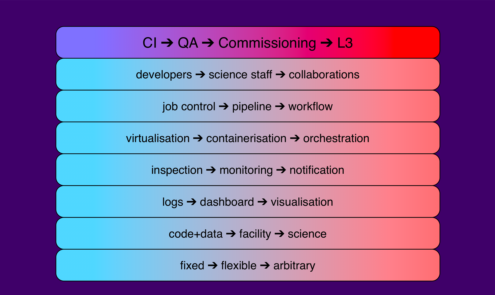
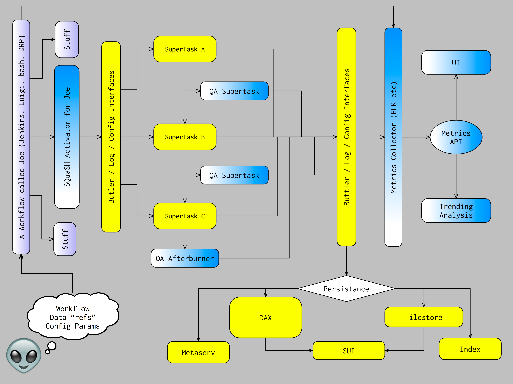

This is an LSST Data Management Technical Note giving a high-level
overview of SQuaRE's principles, and our current vision for delivering
a flexible, sustainable and evolving capability to support software
development, DM subsystem construction, commissioning, operational and
scientific activities; and to do so consistently with its funded
responsibilities and resources in the areas of Quality Assurance,
Integration & Test and Level 3 tools.

For a historical background on the origin of this approach see
:ref:`appendix_a`.

This document also contains a list of areas for improvement of the
controlling documentation. As these issues are addressed, this
document will be updated to remove those sections. 

.. warning::

   THIS IS AN EARLY DRAFT

   This is an early draft published in order to assist the DM Pipelines
   WG in its rework of LDM-151. It is incomplete, unreviewed and
   certainly not baselined. 

Controlling documents
=====================

There are three main documents that reference the QA system:

- LSE-63 has been as described as the requirements document for the QA
  work, but as it title describes, it mostly sets out a framework for
  doing QA. Section 3 has a number of high-level functional and design
  requirements for the QA system that are in general highly compatible
  with the approach outlined in this document. 

- LDM-151 has section 8 relating to QA WBSes. Contrary to the stated
  scope of the document, it doesn't confine itself to the scientific
  aspects of the design but frequently descends into software design
  and implementation. 
  
- LDM-230 has two brief references to the QA system that
  architecturally unclear as to scope and to which system falls their
  implementation.

All three would require some level of change to be consistent with the
approach described in this document, a new requirements flow-down,
re-plan, etc. See :ref:`more_info` for a list of areas particularly
benefiting from updating.

Design Principles
=================

In our approach, we have been driven by the following principles:

- Focus on the ability to service ad-hoc requests whenever possible
  (eg. rather than just provide a fixed metric, allow user to provide
  code that implements their own metric); this reduces the cost of
  change in-house as well as externally

- Write once, use many: service our requirements with a evolving
  system based on modular components that can be re-used in multiple
  contexts 

- Humans are expensive, computers are cheap: Prioritise minimising
  human time over compute time when they are in conflict

- Don't reinvent the wheel: Leverage commodity software, platforms and
  computing whenever possible

- Drive improvements to the stack architecture when these would
  facilitate stack use, re-use, maintainability and/or usability

- Encourage alternative implementations that fit will well within a
  single architectural model to service different requirements, to
  demonstrate interface generality and avoid lock-in, to optimise
  developer velocity

- Deploy-anywhere engineering (deployments use configuration
  management to allow them to be scaled or replicated elsewhere)
  

An evolving roadmap
===================

Our technical roadmap involves an expanding capability based based on
previously released components with a common thread through all of
SQuaRE's deliverables, from simple CI functionality to a full-featured
L3-type capability that allows execution of ad-hoc code on data:

See :ref:`appendix_a` for the full motivation to this approach. It is
important to note that the evolution left to right is cumulative; the
previous functionality still exists, but the capabilities of the
system are expanded.

Current Iteration
=================

At the current design iteration, we are working towards our SQuaSH
architecture strawman:

Consistent with our design principles, we initiated a change in the
command-line task layer of the stack in order to separate the
environment from the science code, thus allowing us to re-use the same
science code in multiple environments, while also being able to optimise
some aspects of the architecture to different use cases (for example,
allowing that code to be executed simply from the command line, or in
an intelligent work-flow system at scale).

This work was aided by our previous iteration, the CI system
design. It uses tooling we developed to, for example, deploy
stack-ready instances for executing stack code. It also uses the log
monitoring system (codename: panopticon) which is also going to be
used for CI, and the UI (at this iteration a dashboard, later also the
SUI) has elements in common with our documentation infrastructure.

For the database, we re-used (and are proposing some changes) to the
SDQA tables in the LSST Database Schema and we are prototyping using
metrics developed for KPM calculation, validate_drp.

The initial production version will support simple data processing runs
on static data sets in order to publish a "QA CI" service to
developers that detects regressions in the codebase and will use
primarily HSC data since the stack is well-supported for that
instrument and we have shared developers that will benefit from our
QA functionality. 

.. _more_info:

Areas lacking definition
========================

The following areas would benefit from input from a Working Group
(whether the current Pipelines WG or a future one) or similar
input. We are primarily concerned in uncovering uncaptured
requirements and making the documentation consistent with itself and
with the technical roadmap. 

LSE-63
   While we believe we are highly consistent with LSE-63 in its spirit, a
   joint WG/SQuaRE examination of LSE-63 clarifying intent/scope in
   certain requirements listed in Section 3 is necessary.

Calibration
   It is clear to us that QA as we astronomers mean it is intrinsically
   linked with a number of calibration aspects. We are not aware of any
   documentation addressing this. LDM-151 seems like the right place to
   capture such requirements.

Environment
   We consider it very likely that in order to perform useful forensics,
   a number quantities beyond the data and its metadata will need to be
   exposed for co-analysis. We understand that much of this data is going
   to be available in the Engineering Facilities Database but we have
   neither audited whether that is sufficient not whether the interfaces
   and APIs to the EFD are suitable for our intended use. Again, LDM-151
   seems like the right place to make sure this is captured. 

Commissioning
   Commissioning has a symbiotic relationship with QA; QA tooling can
   great assist commissioning while commissioning can greatly inform QA
   efforts. We are working with the LSST Commissioning scientist on
   understanding his requirements. These will probably result in a new
   document. 

Operations
   In a high-data-throughput environment it is not sufficient to detect
   QA issues - a system has to be as self-repairing as possible. We
   anticipate that not only does the QA system consume data, but that it
   also could publish services or data that can be used by other systems
   to automatically take corrective action (be it to reject data, to
   repair data, to extrapolate missing data, to page personnel etc). This
   seems out of scope for the construction given the controlling
   documentation except for a brief reference in LDM-230, but we would
   still be interested to identify interfaces that we could provide as
   part of our resourced development that could be useful downstream for
   such purposes.

Level 3
   There are a number of aspects about what has been termed "Level 3"
   processing. Some aspects relate to a provision of compute
   capacity. Others relate to the ability to allow the community to be
   able to interact with the data in custom ways. We believe the approach
   outlined in this document fits in with a "bring your code to the data"
   approach to Level 3 that would allow to science users to leverage our
   architecture enabling ad-hoc code execution on compute capacity that
   they may have access to (eg. university clouds, commodity clouds, NSF
   clouds).
   
   An overall clarification of the current scope for Level 3 is due; we
   have worked with the DM Interfaces Scientist to understand how our
   work can be extended naturally in that direction, but we could benefit
   from a more formal definition in that area. This is especially the
   case as it is not unlikely that significant development of Level 3 is
   likely to happen in Operations, and we want to be well set up to
   deliver a system that can be extended in that direction. A new
   document is likely to be required.

Usability
   The project has so far been somewhat contradictory in its position on
   whether the LSST stack is intended as a user-level product. It is fair
   to say that while this is a goal that has been both publicly promised
   and that is dear to the heart of DM developers (not to mention of
   great service to the astronomical community), we have failed to quality
   the architectural and resource implications of such a commitment. We
   would like to see some clearly stated requirements in this
   area. LDM-151 could be the relevant document.

.. _appendix_a:

Appendix: Historical Background
===============================

Motivation
----------

The Data Management sub-system work during LSST construction is
peformed against a Work Breakdown Structure around which (largely)
institutional teams have been resourced to do design, development and
integration work centered on specific areas of technical activity.

The particular area of activity for the AURA/LSST (aka Tucson) team
was Science QA, and the WBS structure at the beginning of LSST
construction was as follows:

============  ===========================================
02C.01.02     Science Data Quality Integration and Test 
============  ===========================================
02C.01.02.01  SDQA Pipeline 
02C.01.02.02  SDQA Toolkit
02C.01.02.03  L3 Toolkit
============  ===========================================

(prior to Construction start, Calibration Products was also included,
but later was moved to Princeton's WBS). 

The Tucson team took the approach that a key aspect of ensuring the
eventual data quality would be to ensure the quality for the software
that produced it (in the FDR, this was referred to as "Level 0 QA",
Docushare 15232). We therefore developed a strong interest in
supporting activities that are well-understood to be associated with
good code, such as:

- continuous integration
- low-friction development workflows
- low-friction documentation workflows
- regression testing
- portability testing
- supporting good coding practices (code review etc)
- keeping dependencies up to date
- monitoring and forensics
- communication tools
- low-impact release management

We also became concerned about the agility of the codebase, in
particular in minimising the cost of change. Our experience is that
science data quality does not end upon the discovery of a problem but
rather, at the deployment of a solution. 

We therefore sought and obtained the developer support WBS. However we
did not increase our resources to cover these activities, for reasons
including:

- We believed our solutions to these problems would increase
  productivity in other areas important to science quality, in
  particular pipeline development and testing
- We had staff with good velocity in these areas
- We did not wish to disadvantage the institution that previously held
  the developer support WBS

But most critically, we saw that by leveraging recent commodity
software developments we could develop a single technical roadmap that
expands, in an on-going fashion, a set of capabilities that can be
applied to all of our areas of acitivity: developer support, QA
assessment, commissioning/intergration support, and even
functionality consistent with Level 3 goals.\ [#L3]_ As a result,
we intended for the effort in many areas of "developer support" to be
recouped further into construction by being re-used in the QA and L3
context. This document outlines a technical roadmap designed to do
exactly that. 

In order to distinguish this approach from the previous approach of
servicing QA goals as a largely standalone application (SDQA, which
was intended as a re-factoring of the R&D application PipeQA), we have
given this architecture the codename SQuaSH (for Science Quality
AnalysiS Harness). However this is just an implementation choice; it
does not affect the goals or capabilities of the system. 

The SQuaRE "origin story"
-------------------------

This approach to supporting software quality as a way of ensuring
product quality, with a focus on a devops engineering approach that
beats down the operational demands of deployed services through
architectural and implementation choices, is a current practice often
called Site Reliability Engineering. The change of the name of the
group from the Survey Science Group to SQuaRE (Science Quality and
Reliability Engineering) was intended to convey our focus on
sustainable software solutions to service science quality and
scientific utility demands. It was not intended to lessen our focus on
science quality evaluation (which is the primary focus of our
deliverables).

.. rubric:: Footnotes

.. [#L3] There is some difference of opinion as to what Level 3
       "really means" at this point, see later discussion.

